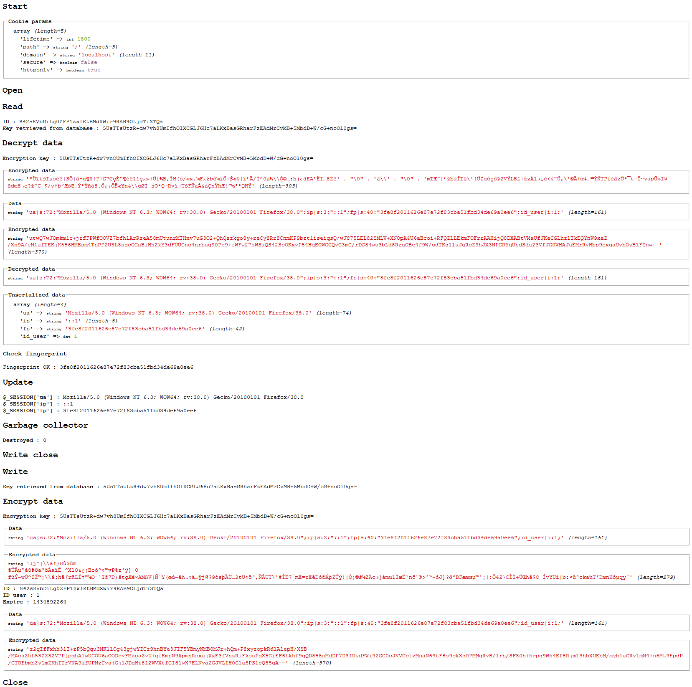

[](https://packagist.org/packages/crazy-max/cws-session)
[](https://php.net/)
[](https://travis-ci.org/crazy-max/CwsSession)
[](https://www.codacy.com/app/crazy-max/CwsSession)
[](https://styleci.io/repos/12613494)
[](https://gemnasium.com/github.com/crazy-max/CwsSession)
[](https://www.paypal.com/cgi-bin/webscr?cmd=_s-xclick&hosted_button_id=ST39UEPCYQUAN)

# CwsSession

PHP class to manipulate sessions. Data are securely encrypted and sessions are stored in database. 

## Installation

```bash
composer require crazy-max/cws-session
```

And download the code:

```bash
composer install # or update
```

## Getting started

Add a new table in your database with the following structure.<br />
You can change the name of the table (sessions) but not the columns.

```sql
CREATE TABLE IF NOT EXISTS `sessions` (
  `id` varchar(128) NOT NULL,
  `id_user` int(10) unsigned NOT NULL DEFAULT '0',
  `expire` int(10) unsigned NOT NULL DEFAULT '0',
  `data` text NOT NULL,
  `skey` varchar(128) NOT NULL,
  PRIMARY KEY (`id`)
) ENGINE=InnoDB DEFAULT CHARSET=utf8;
```

**id** - the session id.<br />
**id_user** - the user id from your application. If you want to use it, use getParamUserId/setParamUserId methods.<br />
**expire** - the session cache expire.<br />
**data** - the session data.<br />
**skey** - unique key for data encryption.<br />

See `tests/test.php` file sample to help you.

### Disconnect all users

If you want to disconnect all the users from your PHP application, execute this query :

```sql
TRUNCATE TABLE `sessions`;
```

### Count visitors and users connected

If you want to count visitors and users connected on your PHP application, execute this query :

```sql
SELECT (SELECT COUNT(*) FROM `sessions` WHERE `id_user` > 0 LIMIT 1) AS nb_connected,
(SELECT COUNT(*) FROM `sessions` WHERE `id_user` = 0 LIMIT 1) AS nb_visitors;
```

You have to use the `setParamUserId` method when the user is logged in.

## Example



## Methods

**process** - Start the process.<br />
**start** - To call everytime you want to start a new session instead of session_start().<br />
**regenerate** - Regenerates the session and delete the old one. It also generates a new encryption key in the database. To use each time a user connects to your application successfully.<br />
**update** - Update specific session vars (user agent, IP address, fingerprint).<br />
**isActive** - Check if the session is active or not.<br />

**getLifetime** - The session life time.<br />
**setLifetime** - Set the session life time (in seconds).<br />
**getCookieDomain** - The domain of the session cookie.<br />
**setCookieDomain** - Set the domain of the session cookie (eg: .foo.com).<br />
**getSessionName** - The session name.<br />
**setSessionName** - Set the session name. (default PHPSESSID).<br />
**isFpEnable** - The fingerprint enable status.<br />
**setFpEnable** - Enable/disable fingerprint.<br />
**getFpMode** - The fingerprint mode.<br />
**setFpModeBasic** - Set the fingerprint mode basic. (default)<br />
**setFpModeShield** - Set the fingerprint mode shield.<br />
**getDbExt** - The database PHP extension used to store sessions.<br />
**setDbExtMysql** - Set the database PHP extension used to store sessions to mysql.<br />
**setDbExtMysqli** - Set the database PHP extension used to store sessions to mysqli.<br />
**setDbExtPdo** - Set the database PHP extension used to store sessions to pdo. (default)<br />
**getDbPdoDriver** - The PDO driver to use. (if db extension is Pdo)<br />
**setDbPdoDriverFirebird** - Set the PDO driver to firebird.<br />
**setDbPdoDriverMysql** - Set the PDO driver to mysql. (default)<br />
**setDbPdoDriverOci** - Set the PDO driver to oci.<br />
**setDbPdoDriverPgsql** - Set the PDO driver to pgsql.<br />
**setDbPdoDriverSqlite** - Set the PDO driver to sqlite.<br />
**setDbPdoDriverSqlite2** - Set the PDO driver to sqlite2.<br />
**setDbPdoDriverSqlsrv** - Set the PDO driver to sqlsrv.<br />
**getDbHost** - The database host name or IP address.<br />
**setDbHost** - Set the database host name or IP address.<br />
**getDbPort** - The database port.<br />
**setDbPort** - Set the database port. Leave empty if your are not sure.<br />
**setDbUsername** - Set the database username.<br />
**setDbPassword** - Set the database password.<br />
**getDbName** - The database name.<br />
**setDbName** - Set the database name.<br />
**getDbCharset** - The database charset.<br />
**setDbCharset** - Set the database charset. Leave empty if your are not sure.<br />
**getDbTableName** - The database table name to store sessions.<br />
**setDbTableName** - Set the database table name to store sessions (default 'sessions').<br />
**getParamFp** - The fingerprint SESSION value.<br />
**getParamUserId** - The user id SESSION value.<br />
**getParamUa** - The user agent SESSION value.<br />
**getParamIp** - The ip address SESSION value.<br />
**getParam** - A SESSION value by key. Use this method instead $_SESSION var.<br />
**setParamUserId** - Set id_user SESSION value. A user id from your application.<br />
**setParam** - Set a SESSION key/value. Use this method instead $_SESSION var.<br />
**getError** - The last error.

## How can i help ?

We welcome all kinds of contributions :raised_hands:!<br />
The most basic way to show your support is to star :star2: the project, or to raise issues :speech_balloon:<br />
Any funds donated will be used to help further development on this project! :gift_heart:

[](https://www.paypal.com/cgi-bin/webscr?cmd=_s-xclick&hosted_button_id=ST39UEPCYQUAN)

## License

MIT. See `LICENSE` for more details.
